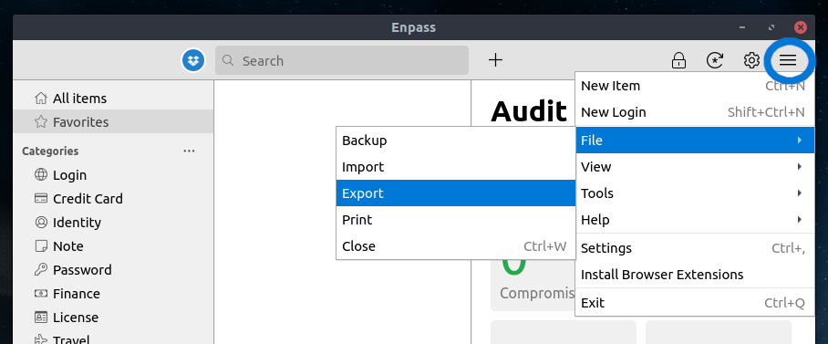
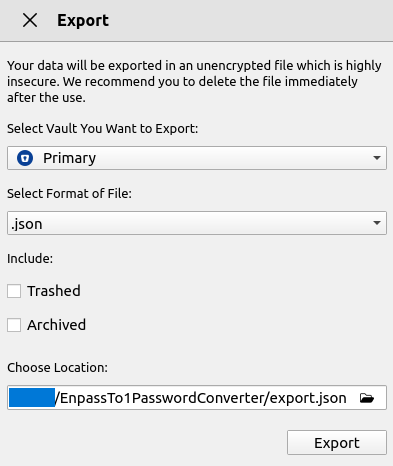
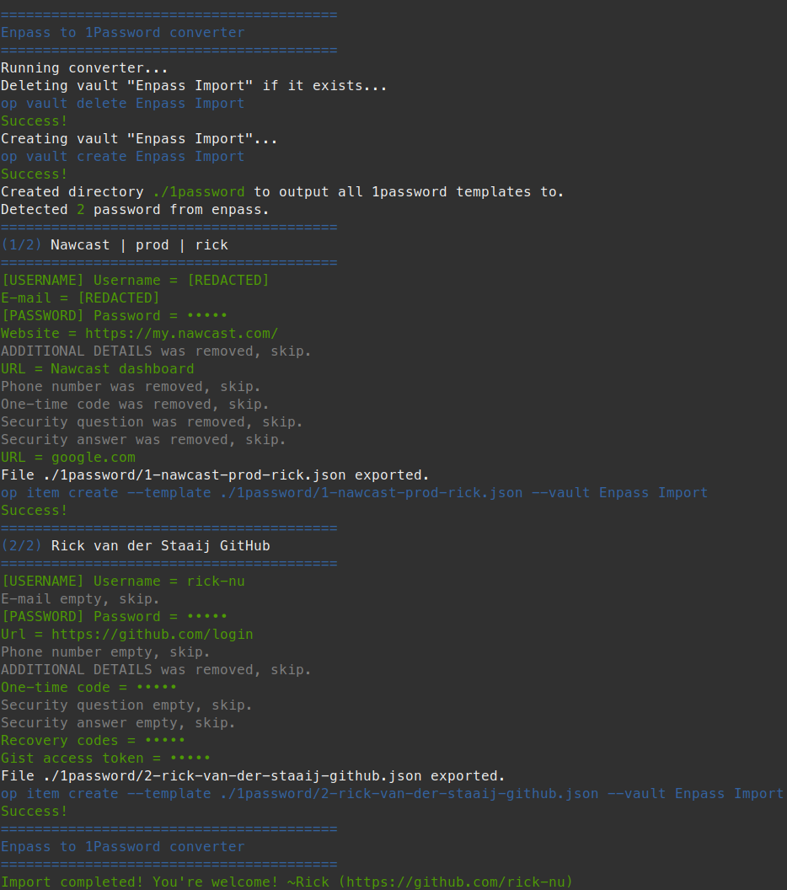

# Enpass to 1password converter

Unfortunately, 1password does not provide a proper converter when migrating from [Enpass](https://enpass.io) to
[1Password](https://1password.com). This project converts an `enpass json export` to `1password json templates`. These
1password template files can then be imported using 1Passwords CLI.

## Requirements

Have the following installed on your PC:

- [deno](https://docs.deno.com/runtime/getting_started/installation/)
- [1password CLI](https://developer.1password.com/docs/cli/get-started/)

## How to run

1. Download this project to your PC
1. Make sure you have installed the requirements
1. Make sure 1Password is running
1. Open Enpass, click the menu > file > export.
    > 
1. Export `export.json` to the same location as this downloaded project
   > 
1. Go to the project in your terminal and run:
    ```shell
    deno --allow-read --allow-write --allow-run enpass-to-1password.ts
    ```
    - `--allow-read`: to read the `export.json` from Enpass
    - `--allow-write`: to create 1Password template `.json` files in `./1password/`
    - `--allow-run`: to execute `op` (the 1Password CLI tool) commands to:
        - Delete an existing `Empass Import` vault
        - Create a new `Enpass import` vault
        - Create new `login` items in the 1Password `Enpass import` vault based in the `export.json`
1. Running the script make take a while, depending on how many password you've stored in Enpass. There is a clear
  progress indicator in the scripts output.
1. All done, consider a (small) donation (https://github.com/sponsors/rick-nu)

## Example output


